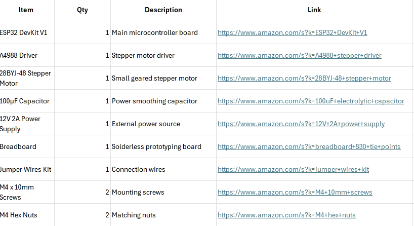

# Automatic Rollerblind 

# Description
Samll stepper motor, that would attach to your rollerblind mechanism and would move them for you.

# Why?
To save time and make your room more futuristic

# Notes

- Due to my rollerblind autolocking mechanism, i couldn't spin stepper motor, but perhaps for you mechanism this design might work.

# Galery

# BOM

