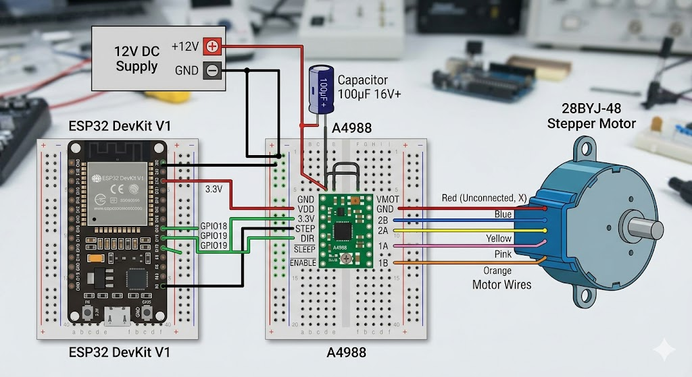
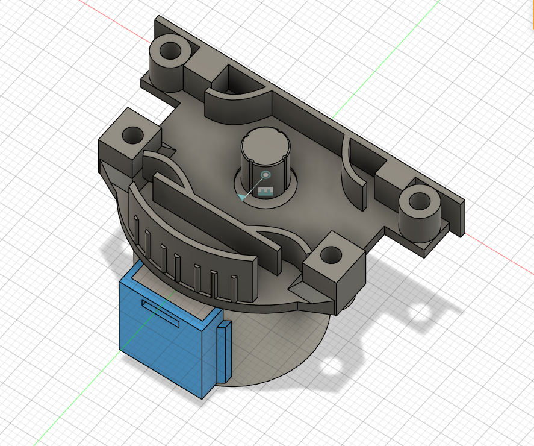
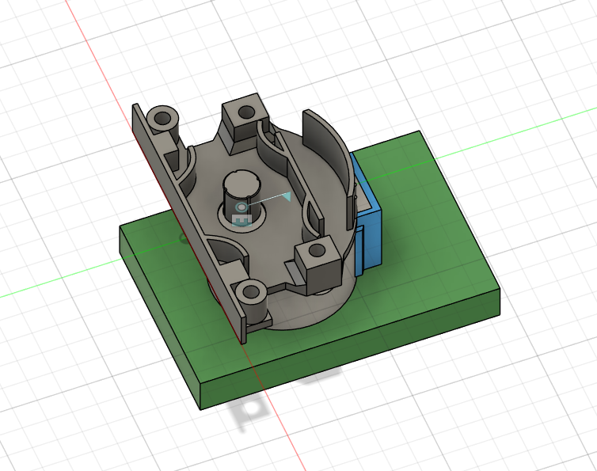

# Automatic Rollerblind 

# Description
Samll stepper motor, that would attach to your rollerblind mechanism and would move them for you.

# Why?
To save time and make your room more futuristic.

# Notes

- Due to my rollerblind autolocking mechanism, i couldn't spin stepper motor, but perhaps for your mechanism this design might work.
- For this design you have to convert unipolar stepper motor into bipolar stepper motor. 

# Wiring
Here is simple wiring diagram, I found on the internet and used in this project.

# Galery

# BOM

